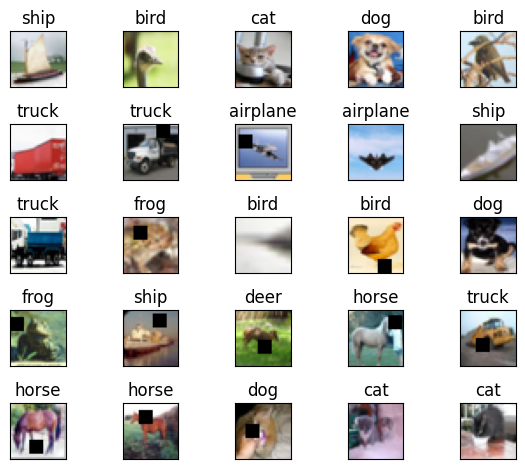

# 🌐 Residual_Connections
Residual Connections in CNNs

## 📌 Problem:
Here, objective is to develop a robust inference system that can accurately classify previously unseen images from the CIFAR-10 dataset into their respective categories. To achieve this, we employ ResNet (Residual Networks) architectures, known for their exceptional performance in image classification tasks.

## 📊 Dataset:
In this Assignment, we work with a dataset known as CIFAR-10, which you can find more information about [here](https://www.cs.toronto.edu/~kriz/cifar.html). This dataset comprises 60,000 color images, each with dimensions of 32 x 32 pixels. It is divided into ten distinct classes, with 6,000 images assigned to each class. Among these images, 50,000 are designated for training purposes, while the remaining 10,000 are reserved for testing.

Below, you can find a selection of images from the dataset, each accompanied by its corresponding label. These images serve as representative examples, providing a glimpse into the diverse visual content present within the CIFAR-10 dataset.

## 📹 Demo:

https://github.com/VijayPrakashReddy-k/Residual_Connections/assets/42317258/e89bb86a-f721-43f5-b0fc-4b6e171a4bdb

